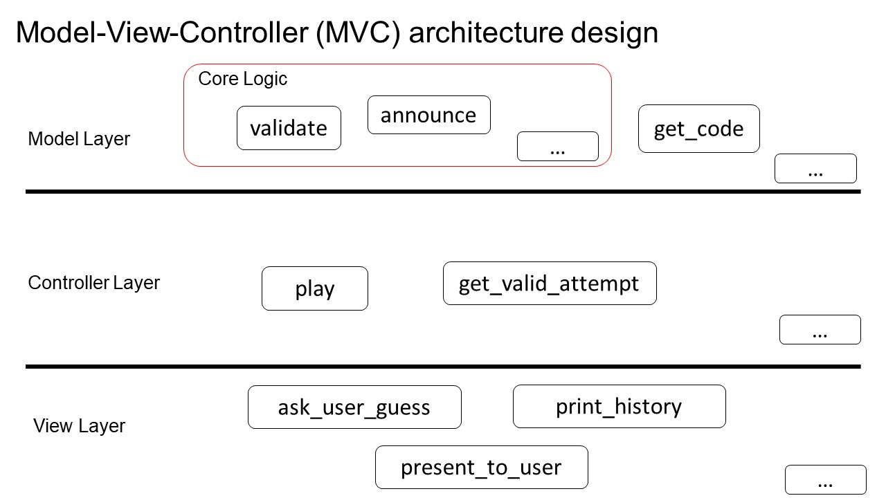
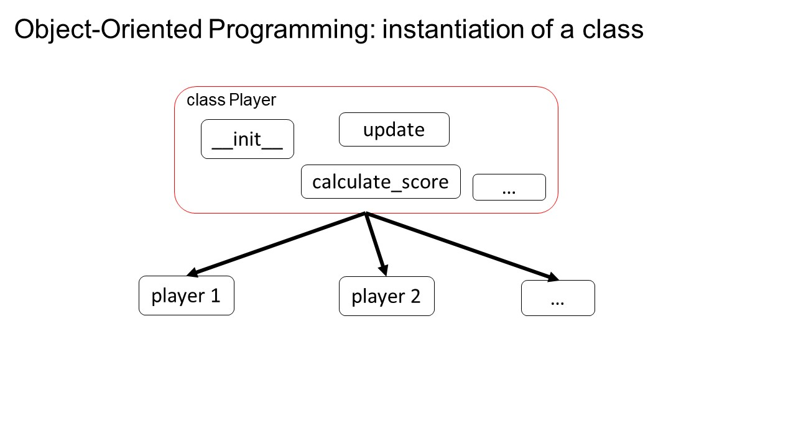
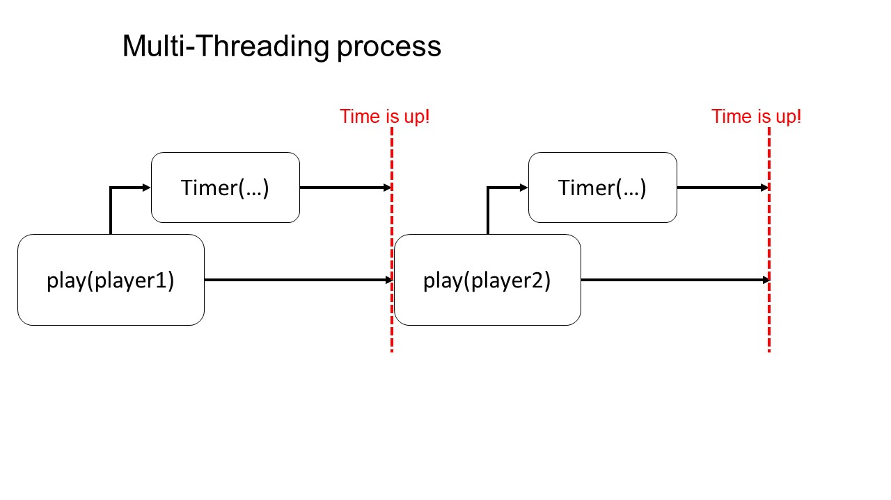
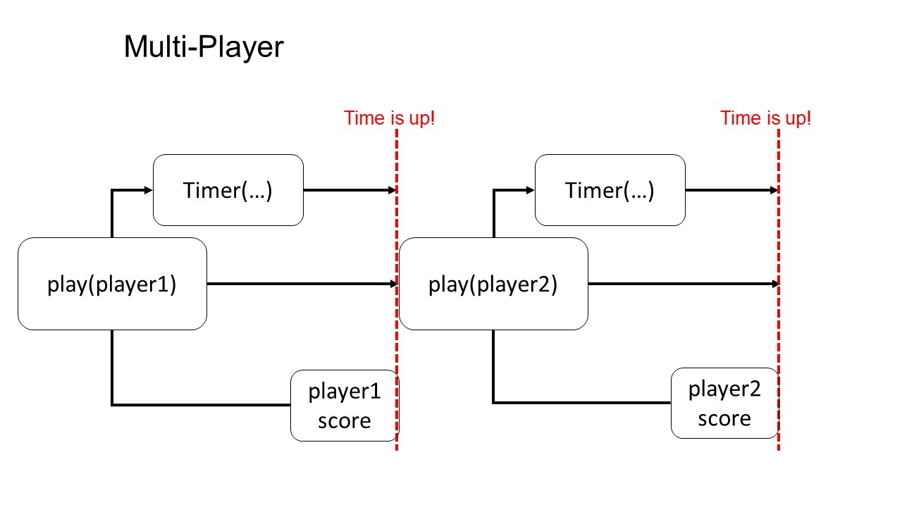
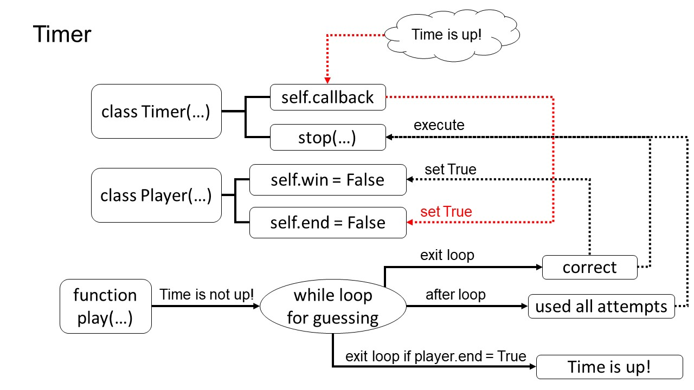

# Project Cat: 

## Implementation of a classic game in Command Line Interface to demonstrate the coding skills.

Thank you for reading the document. This project is my work to showcase the implementation of a classic game. It is built from the scratch. Several concepts listed below are involved and designed in the codes as following. They will be discussed in details later in the Section B Code Design.

* Model-View-Controller (MVC) architecture design
* Object-Oriented Programming: instantiation of a class
* Multi-Threading process
* Unit Testing


## A. How to run this project
1. Clone this project to your local environment from my github page: https://github.com/farrenhi/cat/tree/main

2. If your computer is not installed with Python, you will need to install Python firstly. Related info in Python official website. https://www.python.org/

3. Install related libraries. The following are libraries (and version info) I used. You probably do not need to install exact version, but just as a reference.
* pytest 8.1.1
* requests 2.31.0
* requests-mock 1.12.1

    Or, try the following command line. We should be able to install libraries from a document called: requirements.txt

    ```bash
    pip install -r requirements.txt
    ```
    
By the way, my python version is Python 3.11.4.

4. In terminal, move to the local folder of this project. (The same level as controller.py)

5. Run the following command in terminal. Then, you should see that the game is starting! Enjoy it!

    ```bash
    python controller.py
    ```

    or

    ```bash
    python3 controller.py
    ```


## B. Code Design
### - Model-View-Controller (MVC) architecture design

Question: how to implement the codes in different platforms?

I have 3 phases of development work starting from the scratch. 

Phase 1 was simply to lay out several modules/functions to make the code run. However, I started to think about how to run the code on different platforms as mentioned in the guidance (web page, mobile app, command line etc). The question was that if I switched to web page design, then which part of codes should I change? Furthermore, which part of codes were remained unchanged? Things became clear when I thought of the concept of Model-View-Controller (MVC) architecture design. This would be the onset of phase 2.

Phase 2 was to convert my codes (modules/functions) into MVC design. In this design pattern, things would be easier to render the view layer on different platforms. The solution is to change view layer for different applications (web page/mobile app/etc). The controller layer and model layer remain unchanged or slightly changed. The view layer is to render the result or to take input from a user. The controller layer is to communicate between view layer and model layer. The game flow is in the controller layer. Finally, model layer processes data and validates the user input. Details in each layer would be discussed in next paragraph.

Let's walk through what is in each layer. 

Firstly, the core logic block is in model layer. The validate function is to verify the user input with secret code and to provide True/False results. The announce function would take the validation result and convert it into human readable feedback statement. The get_code function is to call external API for secret code for the game. 

Secondly, controller layer is served as a bridge between model layer and view layer. The play function is to control the game flow, and to execute functions from different layers. The get_valid_attempt function is to make sure a valid user input. The function would execute the function from model layer to check if valid. If not valid, the control layer function would execute functions in view layer to ask user to guess again.

Lastly, view layer is designed to interact with a user. The functions are used to ask for user input or to show user output/data. For example, the ask_user_guess function is to ask user to enter their guess of numbers. The present_to_user function is to render the results from control layer to user. The print_history function is to present history data of guesses and feedbacks to user.

Overall, the implementation of MVC design would make the transition of platforms more smoothly. Furthermore, our next question is that what if we have multi-players in a game? This type of question would bring us to the next phase. Phase 3 is instantiation of a class in object-oriented programming. Let me walk you through the concept in the next section.

### - Object-Oriented Programming: instantiation of a class

Question: how to implement multi-players?

What if we have several players in a game? This situation is similar to a classical software engineering topic: banking accounts. Each account is an instantiation of a class. To open a new bank account for a person is just like to create a new instance from a class. Based on this concept, here comes the phase 3.

Phase 3 is to change the codes further into class/instance code structure. I built a class of Player in model layer to store any info related to a player as illustrated above. The instance of the class has multiple attributes to store the data. The class also has some functions. For example, the update function is to update an instance (a player) data like name, score, and feedbacks. The calculate_score function is to calculate a player's score based on the attributes of an instance. I will talk about details of scoring system in Section C Score System.

I also made controller layer and view layer into class objects. As for the model layer, I only made a class of player. The rest of functions in the model layer is not in a class. I think it should be ok like this, because the logic does not change based on different players. All players are under the same logic, which is in the model layer.

### - Multi-Threading process

Question: how to set up a timer?

While a user is playing a game, we want to run a timer counting down the time simultaneously. I use multi-threading to run timer while the play function is still ongoing. This timer would be triggered in the middle of the function play. When the timer is done, it would also end the current game. Then, the loop will go to next player's round.

### - Unit Testing
Question: how to make sure inputs and outputs are functioning correctly?

I use unit testing to ensure that a function is working well. Pytest is the python version package about unit testing. I also use doctest in some function for a quick and simple unit test.

The following steps show you how to run unit test on this project.

1. Go to the directory of unit_test folder.

2. Enter these commands separately in the terminal:
    
    ```bash
    pytest controller_test.py
    ```

    ```bash
    pytest model_test4.py
    ```

    ```bash
    pytest call_api_code_test.py
    ```

3. You will see test result in the terminal.

## C. Extensions
### - Configurable Difficulty Level: adjustment of number of numbers, support to give hints
I set up 3 difficulty levels: easy, medium, and hard. User could choose a difficulty level before starting the game. The configuration is stored as class attribute in the class of player for user to choose. Once a level is chosen, the level info is stored in instance attribute. There are four parameters about different levels.

* (parameter: easy/medium/hard)

* duplicate: False/True/True. Duplicate numbers are allowed or not. Easy level has no duplicate numbers.

* total_values: 4/8/10. Easy level has secret code ranging from 0 to 3 (4 numbers). Ex: [0, 3, 1, 2] Hard level would have numbers from 0 to 9 (10 numbers). This parameter is to implement the adjustment of number of numbers that are used.

* announce_level: 0/1/2. This is related to the feedback on the validation result. Medium level has the same feedback style as the assignment. Hard level just reveals "You win!" or "Incorrect". (yeah... I know it is too hard with less info!) Easy level has more hints such as position info and number info. This parameter implements the support to give hints.

    Easy level has the support to give hints as following example.
    ```bash
    "Feedback: Position 2 is correct. Number 5 is not in the code."
    ```

* max_attempts: 15/10/6. It is about how many times a user could guess. Medium level is default with 10 times. Easy level is 15 times, while hard level is only 6 times.

In general, these parameters could be further fine-tuned and added with new parameters.

### - Multi-Player

The overview of design is provided in Section B Object-Oriented Programming: instantiation of a class. In this paragraph, we will talk about more details in this section.

There are several ways for game play with multi-player. My approach is that each player will play against computer. One player will play a round of game and get the score at the end of round. Then, the second player would play the game and get the score at the end. Therefore, players could compare the scores to see who is the winner.

Current numbers of players is either 1 or 2. This could be modified to more than 2 players. And, if we would like to change the game play flow to other forms, this is feasible based on the current design of class object and instantiation.

### - Score System
I implement the function of calculate_score in the class of player. The function will calculate the player's score based on the attributes from a player instance. There are several parameters as following.

* duplicate number or not.
* guess correctly to win the round or not
* number of numbers that are used for secret code
* announce level, support to give hints
* attempts left
* time left
* correct numbers and correct positions

Weighing factors are put on different parameters. A user will get final score based on this function. However, the whole system needs further fine-tune, so it would be more fair for players among different difficulty levels. For example, the topic is how to compare one player in easy level and the other one in hard level in terms of the score system.

### - Timer
Previously in Section B Multi-Threading process, I described the code design for the timer implementation. Here, I will talk about the detail settings.

Timer is a class object in controller layer (controller.py). It has 3 functions: start, stop, and _run_timer. When it is counting down, _run_timer function would be running by threading module. Timer is triggered in function play (controller class), after secret_code is generated.

In the following diagram, I would like to explain the relationships among class timer, class player, and function play in a high level view. The while loop in function play would iterate through the guessing process. Firstly, if time is not up, and a user guesses correctly, it would set player.win as True and execute the stop function in class timer. So, function _run_timer inside class timer would be stopped. Time left is recorded. Secondly, if a user runs out all guess attempts, it would leave the loop and stop the timer. Lastly, if timer is up, it would trigger timer.callback function to set player.end as True. This key attribute will impact the while loop in play function. It would not enter the loop and skip the loop for guessing iteration. I got this design idea from membership log-in/log-out status in the web development. Essentially, it is a switch to store if the game is ended or not. (like logged in or not)


### - Exchange attempts for more hint
This feature enhances the game's enjoyment factor. As soon as the game begins with a randomly generated secret code, it offers the option to trade 3 guess attempts for knowledge of the first digit in the secret code.


## D. Known Issues and Future Work
### 1. Unit Test on class controller function play is not built up.
The play function becomes a very huge and complicated function. When it comes to unit testing, ths part is not simple. Things are convoluted. I did not finish the unit test on this function. My thought is to further decouple the function and make it into several small functions for testing. However, I will need to re-evaluate the whole game play and the flow. The current function was not well designed to include all the features together.

### 2. Virtual Environment is not implemented.
It should be implemented with virtual environment.

### 3. Validation/Sanitization on user input (view layer)
I implement some logics to verify the user input, but it was not well-rounded enough to prevent any malicious input. The input might hurt the database if it is stored into database or impact the code. I think there should be some libraries/packages to check/sanitize the user input.

### 4. External API for secret code. Need to have a backup plan.
Currently, the secret code generation is solely relying on external API HTTP request. I have seen there was one or two times that the API was down. There is a need to set up a second source. Or, could I just use random package in python to generate the code? Would it be compute-power-demanding? (like would impact the server)

### 5. The display of timer in command line interface. Is it possible to do flashing style?
I think this issue would be very minor, because the display function on command line interface is very limited. In the end, the view layer would be on web page or mobile app.

I was trying to make a flashing style display to update the remaining time. However, this style would keep updating on the place where user input the guess. I do not think there is a good solution. The other method is to keep printing out new remaining time, but this way would be too many update frequently for output on a monitor. Fox example, one line per one second. I decided to stop developing this branch, feature-timer-flashing.

For future work, the update of remaining time would be easier implementation on web page development.

### 6. Database implementation
This one is for future work. There should be a server for players to be connected. A central database is used to save and exchange player's data.


This is the end of the document. If you have reached here, thank you for your time and patience. I enjoyed a lot during this project. It was challenging but also rewarding. I would like to thank you again for this opportunity and hope we will meet each other during my coding journey.